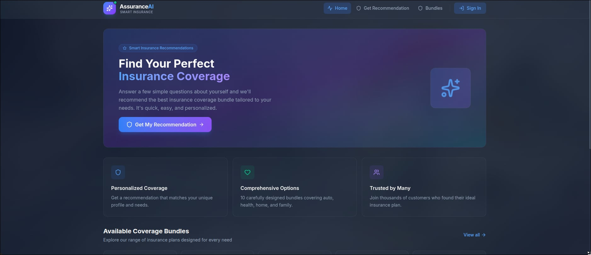
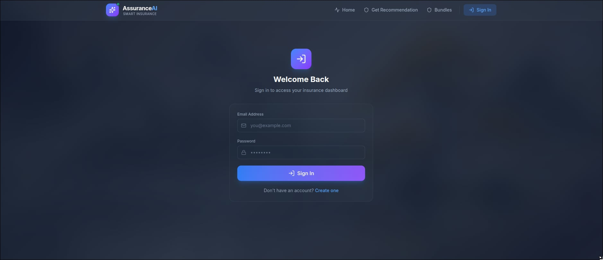

# 🛡️ AssuranceAI — Smart Insurance Coverage Recommender

> Built for **DataQuest Hackathon** — helping insurance companies match clients to the right coverage bundle in seconds, powered by machine learning.

---

## What Is This?

Insurance agents spend hours manually analyzing client profiles before recommending a coverage plan. AssuranceAI automates this entirely.

A client fills out a form with their personal and financial information. The system runs it through a trained **CatBoost ML model** and instantly recommends the most suitable insurance bundle — with a confidence score — from 10 predefined coverage tiers (Basic → Platinum).

The platform serves two types of users:

- **Clients** — fill a form, get a personalized recommendation, view their history
- **Admins** (insurance company staff) — manage users, view all predictions, monitor system health

---

## Live Demo

> Screenshots from the platform:

| Home / Dashboard | Login Page |
|---|---|
|  |  |

---

## Key Features

### For Clients
- Fill a guided form with personal/financial details
- Get an instant AI-powered insurance bundle recommendation
- See confidence scores for all 10 coverage tiers
- View full prediction history

### For Admins
- Dashboard with system-wide statistics
- Full user management
- Complete prediction history across all users
- Cache management controls

### Under the Hood
- **JWT Authentication** — secure login/register with bcrypt password hashing
- **In-Memory Prediction Cache** — SHA-256 key hashing, 1h TTL, 1000-entry max with LRU eviction (saves redundant model calls)
- **MLOps Pipeline** — safe model retraining with F1 comparison, automatic backup, and audit log
- **CI/CD** — GitHub Actions runs 14 pytest tests + frontend build on every push
- **Scheduled Retraining** — weekly or manual trigger via GitHub Actions

---

## Tech Stack

| Layer | Technology |
|---|---|
| Frontend | React, Vite, Tailwind CSS, Axios |
| Backend | FastAPI, Uvicorn, Pydantic v2 |
| Database | PostgreSQL (Neon) |
| ML Model | CatBoost, scikit-learn, pandas, numpy |
| Auth | JWT (python-jose), bcrypt |
| MLOps | GitHub Actions, pytest, in-memory LRU cache |

---

## Project Structure

```
Assurance_Ai/
├── model/
│   ├── solution.py            # Inference pipeline (preprocess → predict)
│   ├── train_and_export.py    # Training pipeline + feature engineering
│   └── model.pkl              # Trained model artifact (gitignored)
├── backend/
│   ├── api.py                 # All API endpoints
│   ├── auth.py                # JWT auth + bcrypt
│   ├── cache.py               # In-memory cache (TTL, LRU)
│   ├── config.py              # Bundle definitions + form field labels
│   ├── database.py            # PostgreSQL connection (Neon)
│   ├── model_service.py       # Model loading + prediction service
│   └── schemas.py             # Pydantic request/response models
├── frontend/
│   └── src/
│       ├── pages/             # Dashboard, Predict, Bundles, Login, Register, Admin, History
│       ├── components/        # Navbar, PredictionResult
│       └── services/          # Axios client with auth interceptor
├── scripts/
│   └── retrain.py             # Safe model retraining pipeline
├── tests/
│   └── test_api.py            # 14 pytest tests (auth, predict, cache, admin)
├── .github/workflows/
│   ├── ci.yml                 # Auto test + build on push
│   └── retrain.yml            # Scheduled/manual retraining
└── docs/                      # Screenshots
```

---

## API Endpoints

| Endpoint | Method | Auth | Description |
|---|---|---|---|
| `/api/health` | GET | — | Health check |
| `/api/bundles` | GET | — | List all 10 coverage bundles |
| `/api/form-schema` | GET | — | Form fields with labels |
| `/api/auth/register` | POST | — | Register new user |
| `/api/auth/login` | POST | — | Login → returns JWT |
| `/api/auth/me` | GET | User | Current user info |
| `/api/predict` | POST | User | Get coverage recommendation |
| `/api/predictions/history` | GET | User | User's past predictions |
| `/api/cache/stats` | GET | — | Cache hit/miss stats |
| `/api/cache/clear` | POST | Admin | Clear prediction cache |
| `/api/admin/stats` | GET | Admin | System statistics |
| `/api/admin/users` | GET | Admin | All users |
| `/api/admin/predictions` | GET | Admin | All predictions |

---

## Getting Started

### Prerequisites

- Python 3.10+
- Node.js 18+
- A PostgreSQL database (we used [Neon](https://neon.tech) — free tier works)

### 1. Backend

```bash
# Create and activate a virtual environment
python -m venv env
source env/bin/activate  # Windows: env\Scripts\activate

# Install dependencies
pip install -r requirements.txt

# Set up environment variables
cp .env.example .env
# Edit .env and fill in DATABASE_URL and JWT_SECRET_KEY

# Start the API server
python -m uvicorn backend.api:app --host 0.0.0.0 --port 8000 --reload
```

### 2. Frontend

```bash
cd frontend
npm install
npm run dev
```

### 3. Open the app

Navigate to **http://localhost:5173**

---

## Running Tests

```bash
source env/bin/activate
python -m pytest tests/ -v
```

14 tests covering: auth flows, prediction endpoint, cache behavior, and admin routes.

---

## Retraining the Model

```bash
python scripts/retrain.py --data path/to/new_data.csv
```

The script compares the new model's F1 score against the current production model before replacing it. If the new model is worse, the swap is rejected. A backup of the old model is always kept.

---

## Deployment

The app is configured for deployment on **Render** via `render.yaml` and `Procfile`. Environment secrets are managed through Render's dashboard (matching the `.env.example` keys).

---

## Team

Built during the **DataQuest Hackathon**.

---

## License

MIT